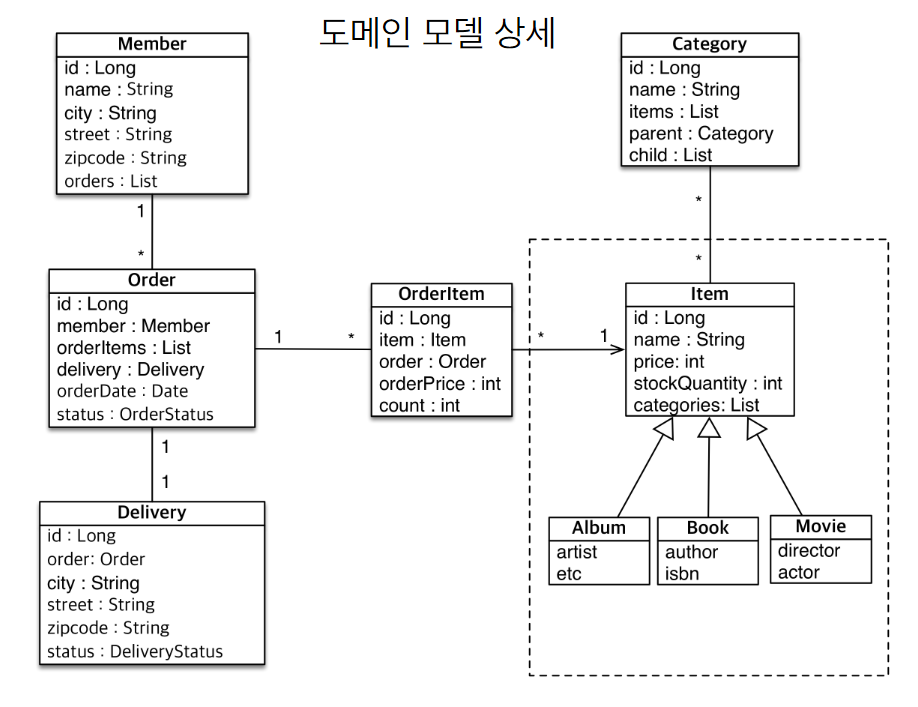
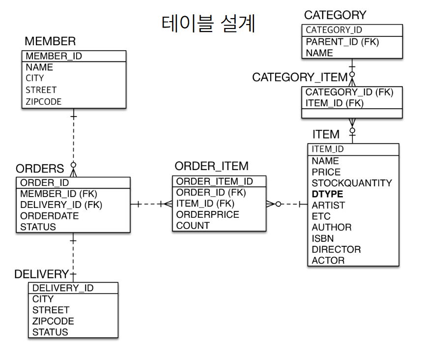

# springbatch-quartz-jpa
Spring Batch와 Quartz 를 이용한 배치 프로세스를 구현하고 JPA를 이용한 간단한 엔티티 설계 프로젝트

# 1. 엔티티 설계 유의 사항
## 1-1. 양방향 매핑은 개발시 양쪽을 참조하도록 개발(양쪽 모두 값이 셋팅되어야 한다)
무엇보다 연관 관계의 주인 쪽에 값을 셋팅하는 것이 중요

## 1-2. 일대다 단방향 or 양방향은 사용하지 않는다.

일대다 양방향은 억지로 구현('다' 쪽에 @JoinColumn(insertable=false, updatable=false))할 수는 있으나 가급적 다대일 양방향을 사용해라

> 다대일 양방향 매핑이 무난하다.

# 2. 엔티티 구조
```
ORDER <-> MEMBER 관계는 **다대일 양방향 매핑**

ORDER <-> DELIVERY 관계는 **일대일 양방향 매핑**

ORDER_ITEM <-> ORDER 관계는 **다대일 양방향 매핑**

ORDER_ITEM <-> ITEM 관계는 **다대일 양방향 매핑**

ITEM <-> CATEGORY 관계는 **다대다 관계를 다대일, 일대다 관계로 풀어서 매핑**

ITEM <-> ALBUM, MOVIE, BOOK 관계는 **싱글 테이블 전략으로 상속 관계 표현**
```

## 2-1. 도메인 모델 구조


## 2-2. 테이블 설계



